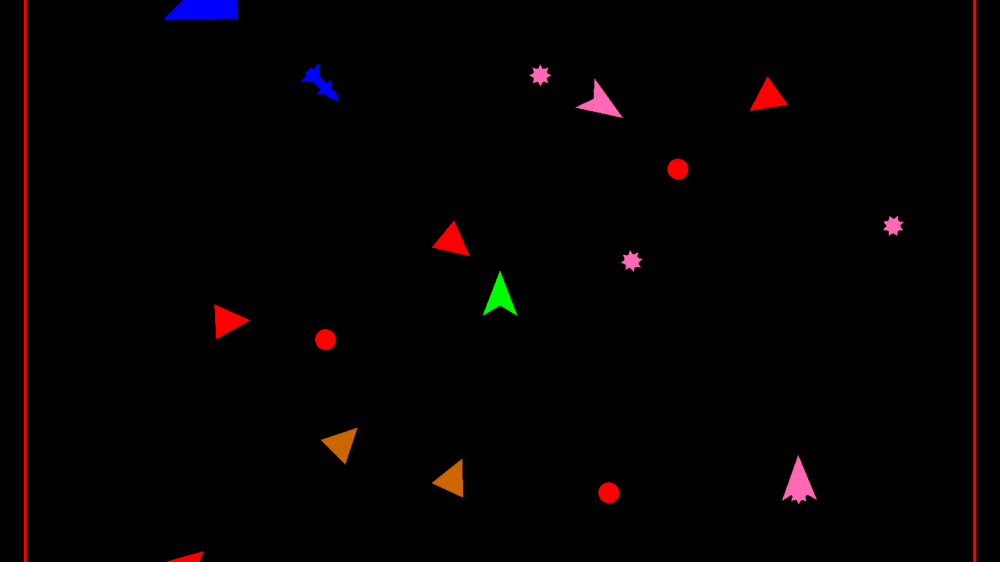

# 🌀 Vortex of Retribution

A bullet hell (of sorts), with one important twist: **you cannot attack**. You control a small green ship, and the only thing you can do is dodge. Enemies and their bullets, mines, homing missiles and blast waves come at you from all sides, and all you can do is weave through them and survive for as long as possible. Touch anything and you're dead. After a short pause the arena resets and you try again.



Enemies are introduced one at a time, easiest to hardest. The full roster is only active after roughly five minutes, so the pressure keeps ramping up the longer you stay alive.

## Controls

| Input | Action |
|---|---|
| `WASD` / Arrow keys | Move (the only thing you can do!) |

## The Enemy Roster

All visuals are procedurally generated primitive shapes. Each enemy is recognizable by its color and behaviour:

| Enemy | Color | Behaviour |
|---|---|---|
| **TailGator** | Red | Chases the player and fires bullets |
| **SwarmSparrow** | Orange | Hunts in flocks, swarming toward the player |
| **WebWeaver** | Pink | Roams the arena, dropping floating mines |
| **SeekerHawk** | Blue | Pursues the player and launches homing missiles |
| **BlinkWolf** | Cyan | Hunts in packs, periodically shrinks away and *blinks* right next to you, then charges |
| **MirrageManta** | Purple | Roams and periodically splits off a clone. Which one is real? |
| **HiveRaptor** | Yellow | Flocks toward the player and kamikaze-dives when close |
| **BlastBadger** | Red-violet | Closes in and periodically releases a blast wave |

## Getting Started

1. Install Unity `6000.5.9f1` (or open the project and let Unity Hub fetch the matching editor version).
2. Clone this repository and open the project folder in Unity.
3. Open `Assets/Scenes/SampleScene.unity` and press Play.

---

## Project Structure

```
Assets/
├── Scenes/
│   └── SampleScene.unity          <-- The one and only game scene
├── Scripts/
│   ├── Behaviours/                <-- MonoBehaviours that give entities their behaviour
│   │   ├── Collision/             <-- Trigger-based collision handling + handler registry
│   │   ├── Flocking/              <-- Boids: Cohesion, Separation, Alignment, FollowTransform
│   │   ├── Projectiles/           <-- Mine & homing missile behaviours
│   │   ├── CameraBehaviour.cs     <-- Follow camera (jittery!)
│   │   ├── PlayerBehaviour.cs     <-- Input, movement & rotation
│   │   ├── ShootBehaviour.cs      <-- Generic "stop, shoot, resume" attack component
│   │   └── ...                    <-- Per-enemy behaviours (BlinkWolf, MirrageManta, ...)
│   ├── GameObjects/               <-- Entity classes: Player, enemies, stars
│   │   └── Projectiles/           <-- Bullet, Mine, HomingMissile
│   ├── ObjectPool/                <-- Generic object pooling (PoolManager, Pool<T>)
│   ├── PrimitiveShape/            <-- Procedural shapes (Triangle, Circle, ship variants)
│   └── Utility/                   <-- ServiceLocator, UnitStats, GenerateWorldBehaviour
```

### How It Fits Together

- **Entities are plain C# classes, not MonoBehaviours.** `Entity` (in `GameObjects/`) creates and owns its `GameObject` in code. Subclasses like `Player`, `TailGator` and `WebWeaver` build themselves out of procedural `PrimitiveShape`s. There are no prefabs or sprites.
- **Behaviour is composed, not inherited.** Entities attach reusable `MonoBehaviour` components from `Behaviours/` (movement, flocking, shooting, collision) to get their personality. A `HiveRaptor`, for example, is a triangular ship + flocking + kamikaze behaviour.
- **Everything is pooled.** `PoolManager` builds a `Pool<T>` per enemy and projectile type (via reflection on the `PoolableType` enum) and recycles entities instead of destroying them. Request entities with `PoolManager.Instance.GetEntity(...)`.
- **`ServiceLocator`** provides global access to shared services. The most important one is the `Player`, which nearly every enemy behaviour needs to find its target.
- **`GenerateWorldBehaviour`** builds the arena (walls + play area), spawns the player and runs the escalating enemy spawn coroutines. It also listens for `Player.OnPlayerDied` to reset the game.
